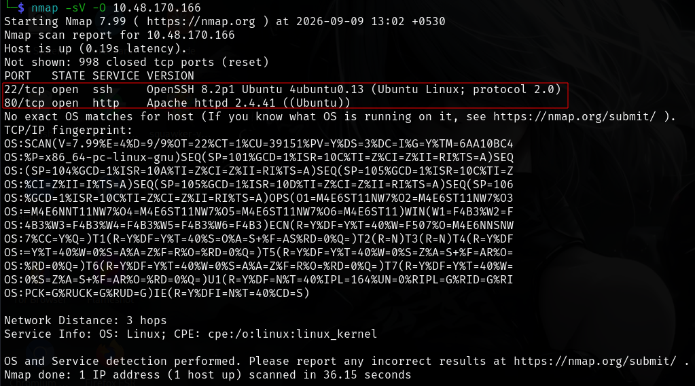
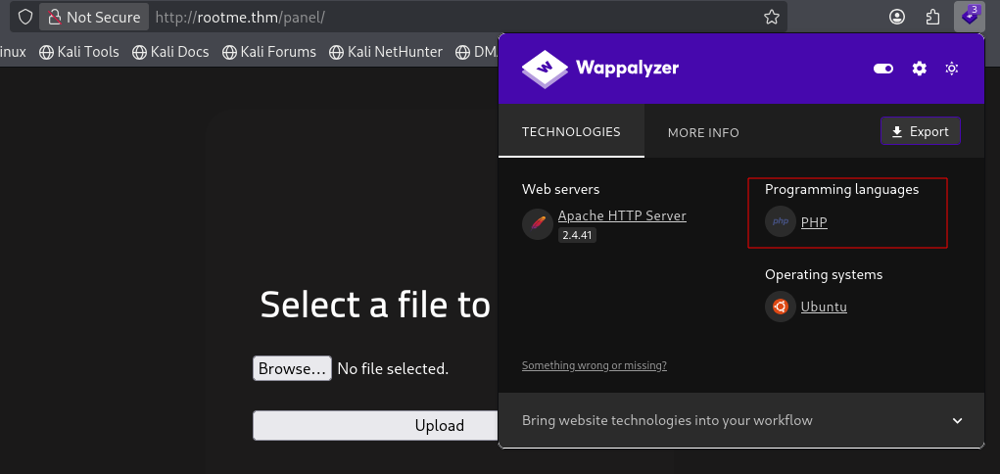
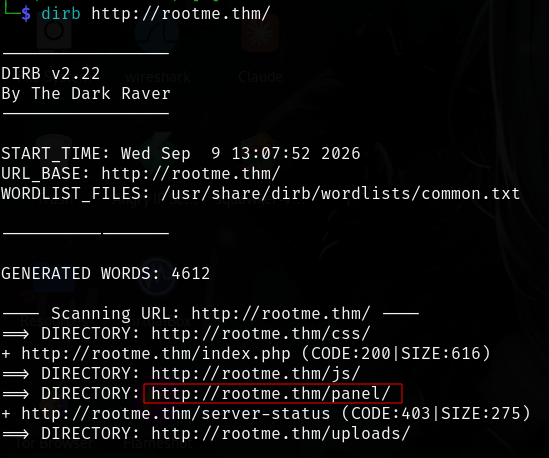
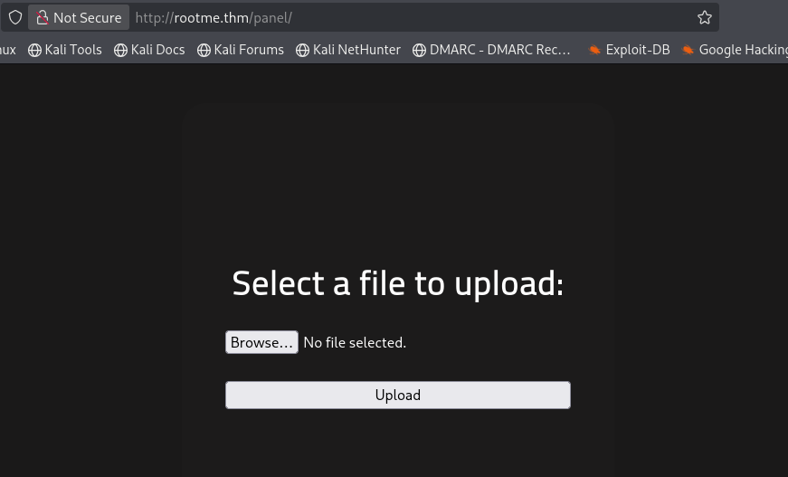
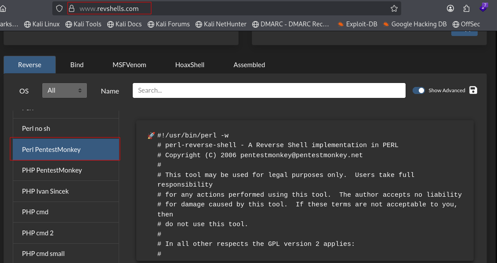
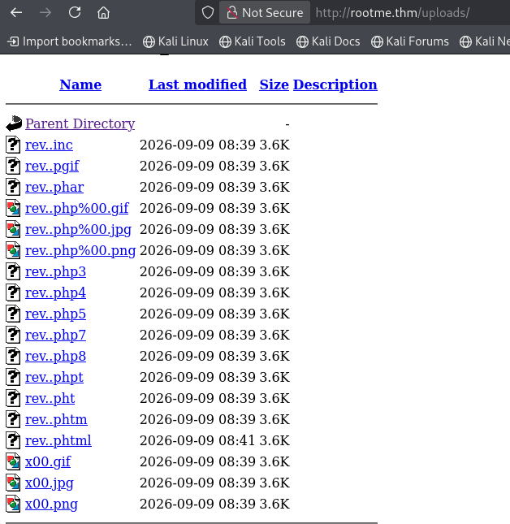
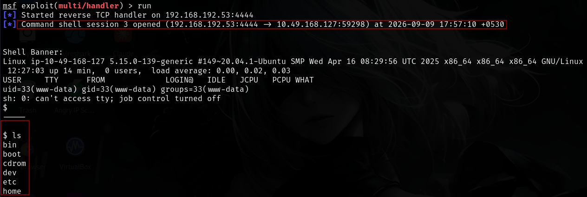
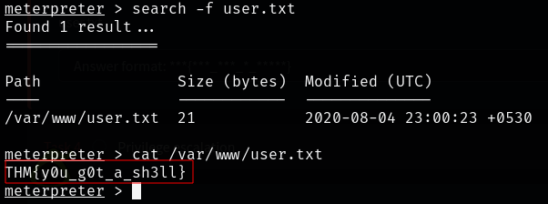
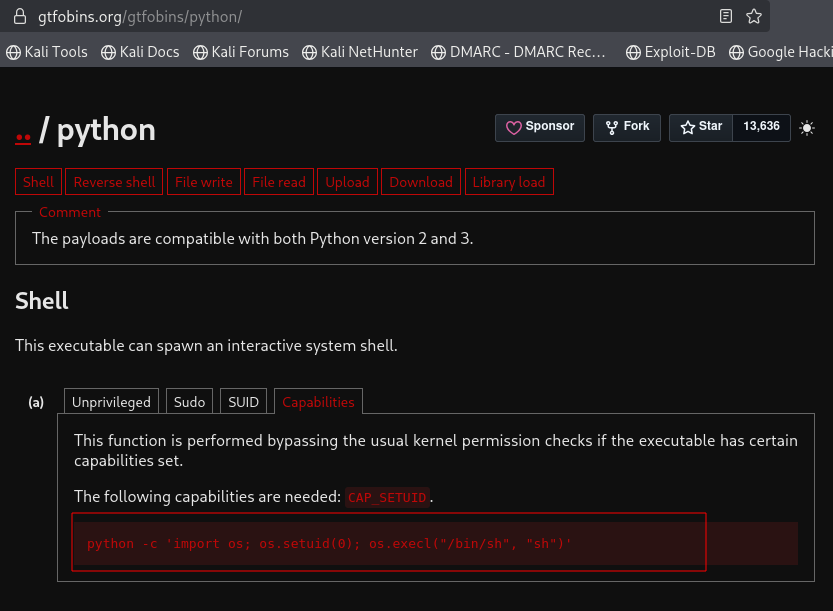
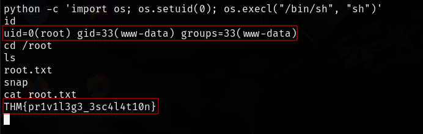

# RootMe — TryHackMe Penetration Testing Report

## 1. Executive Summary

This assessment was performed against the intentionally vulnerable **RootMe** machine provided by TryHackMe.

The assessment involved network reconnaissance, service enumeration, web application analysis, directory and subdomain enumeration, file upload testing, exploitation of a PHP file upload restriction, obtaining initial access, and local privilege escalation through an identified SUID binary.

The assessment resulted in successful initial access and subsequent privilege escalation within the authorized laboratory environment.

---

## 2. Scope & Environment

| Item            | Details                 |
| --------------- | ----------------------- |
| Platform        | TryHackMe               |
| Lab             | RootMe                  |
| Assessment Type | Penetration Testing     |
| Environment     | Authorized Training Lab |
| Target          | `<TARGET_IP>`           |

> All testing was performed against the authorized TryHackMe laboratory environment.

---

# 3. Reconnaissance

## 3.1 Port & Service Enumeration

An Nmap scan was performed to identify open ports, running services, and service versions.

```bash
nmap -sV -O <TARGET_IP>
```

### Evidence



The scan identified the exposed services and provided the initial attack surface for further enumeration.

---

# 4. Web Application Enumeration

## 4.1 Technology Identification

The web application was analyzed to identify the technologies being used.



Technology identification helped determine the technologies that required further investigation.

---

## 4.2 Directory & Subdomain Enumeration

Directory/subdomain enumeration was performed to identify hidden web resources and additional attack surfaces.

```bash
dirb <TARGET_IP>
```



The discovered resources were investigated for functionality that could potentially be exploited.

---

# 5. Vulnerability Identification

## 5.1 File Upload Functionality

An accessible file upload functionality was identified during web application enumeration.



The upload functionality was tested to determine whether server-side files could be uploaded and executed.

---

## 5.2 PHP Extension Restriction Bypass

The application restricted certain file extensions. Testing revealed that the restriction could be bypassed by using an alternative filename extension accepted by the application.

```Extensions List
.jpeg.php
.jpg.php
.png.php
.php
.php3
.php4
.php5
.php7
.php8
.pht
.phar
.phpt
.pgif
.phtml
.phtm
.php%00.gif
.php\x00.gif
.php%00.png
.php\x00.png
.php%00.jpg
.php\x00.jpg
.inc
```


This demonstrated an insufficient file-upload validation mechanism.

### Security Impact

Improper validation of uploaded files can allow an attacker to upload executable server-side content and potentially achieve remote code execution.

---

# 6. Exploitation

## 6.1 PHP Reverse Shell

A PHP reverse-shell payload was prepared for the authorized laboratory environment.




The payload was uploaded through the vulnerable file-upload functionality.



---

## 6.2 Initial Access

After triggering the uploaded payload, a reverse-shell connection was obtained from the target system.

```Listener setup
msfconsole -q
use exploit/multi/handler
show options
run
```

The obtained shell provided the initial foothold on the target.



---

# 7. Post-Exploitation

After obtaining initial access, local enumeration was performed to understand the compromised environment and identify potential privilege escalation vectors.

The first flag was successfully located during post-exploitation.



---

# 8. Privilege Escalation

## 8.1 SUID Enumeration

SUID-enabled binaries were enumerated to identify programs running with elevated privileges.

```bash
find / -perm -4000 -type f 2>/dev/null
```


An interesting SUID-enabled binary (python 2.7) was identified and investigated as a potential privilege escalation vector.

---

## 8.2 GTFOBins Technique

The identified binary was researched against known Linux privilege escalation techniques.

A corresponding GTFOBins technique was used to demonstrate the privilege escalation path within the authorized lab.




---

## 8.3 Privilege Escalation Evidence

The technique successfully resulted in elevated privileges on the target and The Second flag was also found.



This demonstrated that the identified SUID configuration could be abused to obtain elevated access.

---

# 9. Attack Chain

The complete attack path can be summarized as:

```text
Reconnaissance
      ↓
Nmap Service Enumeration
      ↓
Web Application Enumeration
      ↓
Directory / Subdomain Enumeration
      ↓
File Upload Functionality
      ↓
PHP Extension Bypass
      ↓
PHP Reverse Shell
      ↓
Initial Access
      ↓
Local Enumeration
      ↓
SUID Binary Discovery
      ↓
GTFOBins Technique
      ↓
Privilege Escalation
```

---

# 10. Findings

| Finding                             | Severity | Impact                                      |
| ----------------------------------- | -------- | ------------------------------------------- |
| Insufficient File Upload Validation | High     | Potential server-side code execution        |
| PHP Extension Restriction Bypass    | High     | Allows prohibited file types to be uploaded |
| SUID Privilege Escalation           | High     | Potential elevated privileges               |

> Severity ratings in this lab report are qualitative and intended to communicate the relative security impact within the training environment.

---

# 11. Remediation

### File Upload Security

* Use an allowlist of permitted file types.
* Validate file types using multiple independent checks.
* Do not rely solely on client-side validation or filename extensions.
* Rename uploaded files to server-generated names.
* Store uploads outside the web root where possible.
* Disable execution of server-side scripts within upload directories.
* Apply appropriate filesystem permissions.

### Privilege Escalation Prevention

* Review SUID-enabled binaries regularly.
* Remove unnecessary SUID permissions.
* Apply the principle of least privilege.
* Keep operating-system packages and applications updated.
* Monitor unusual execution of privileged binaries.

---

# 12. Lessons Learned

This lab provided practical experience with:

* Network reconnaissance
* Nmap service enumeration
* Web technology identification
* Directory and subdomain enumeration
* File upload vulnerability testing
* Extension validation bypass
* Reverse-shell based initial access
* Linux post-exploitation enumeration
* SUID privilege escalation
* GTFOBins research
* Technical security documentation

---

# 13. Tools Used

* Nmap
* Dirb
* Wappalyzer
* Netcat
* GTFOBins
* Linux command-line utilities

---

# ⚠️ Disclaimer

This report documents testing performed exclusively against the authorized TryHackMe RootMe training environment.

The techniques described are provided for educational purposes and authorized security testing only.

